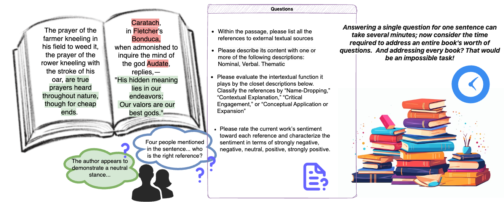
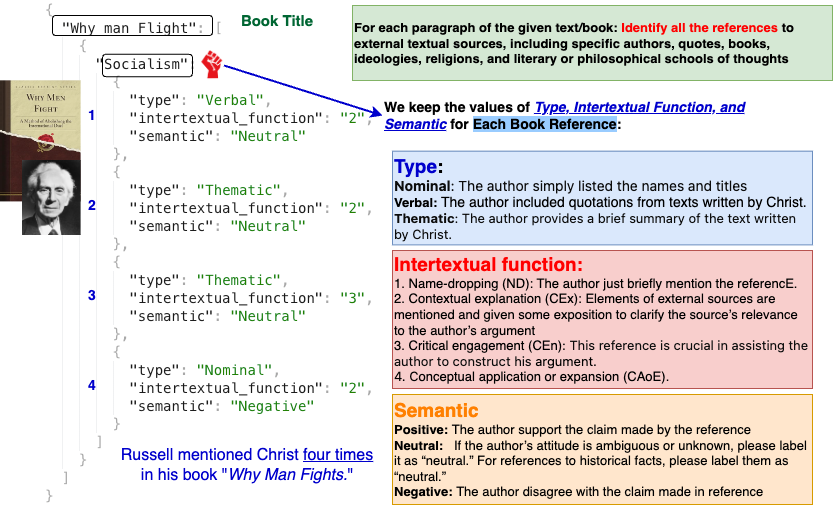

# InterIDEAS_data
The formation and circulation of ideas in philosophy significantly impact pedagogical and scholarly practice. Yet traditional analyses often rely on subjective methodologies limited by human cognitive capacities. 

Addressing this challenge, we introduce InterIDEAS, a pioneering dataset that is the first to combine Large Language Models (LLMs) and human expertise in philosophy.
This LLM and expert-enhanced dataset encompasses over 45,000 pages from key philosophical texts, covering major thoughts and schools from 1750 to 1950, and features more than 3,150 writers.
By integrating theories of intertextuality from literary studies with bibliometric research techniques, InterIDEAS enhances the quantitative and qualitative mining of philosophical knowledge concerning social, historical, intellectual, and interpersonal relations underlying miscellaneous philosophical texts.
We assess its utility in contributing to both the philosophy and the AI communities through a user experiment and a fine-tuning experiment, highlighting its effectiveness in approaching both practical tasks and broad, conceptual questions. Our findings underscore not only how LLMs can assist us to study philosophy quantitatively and qualitatively, but also how philosophy can improve LLMs' performance by extending the scope of its training data. Such mutual contribution paves the way for future interdisciplinary research.

# Data Format



This repository contains the implementation of a NLP model using PyTorch, Hugging Face Transformers, Datasets, and Accelerate libraries. The purpose of this project is to demonstrate the effective use of sequence classification and language modeling techniques using advanced transformer models and optimization methods.

# Fine Tune with Our data
## Installation

Before running the scripts in this repository, ensure that you have Python installed on your system. You can then install the required packages using pip:

```bash
pip install torch datasets transformers accelerate peft

## Jupyter Notebook

For a hands-on, interactive approach, refer to the `implementation_notebook.ipynb` provided in this repository. It guides you through each step of the process, from data loading and preprocessing to model training and evaluation.

To open the notebook, run:

```bash
jupyter notebook Fine-tuning/TC-fine-tuning.ipynb

# License
All the data we currently open to public are originating from Project Gutenberg https://gutenberg.org/about/. Project Gutenberg eBooks may be freely used in the United States because most are not protected by U.S. copyright law. They may not be free of copyright in other countries. Readers outside of the United States must check the copyright terms of their countries before accessing, downloading or redistributing eBooks. We also have a number of copyrighted titles, for which the copyright holder has given permission for unlimited non-commercial worldwide use. For Project Gutenberg, no permission is needed for non-commercial use. So, for example, you can freely redistribute any eBook, anywhere, any time, with or without the Project Gutenberg trademark included. The ``Small Print'' has more details. Note that if you are not in the US, you must confirm yourself whether an item is free to redistribute where you are.

The copyright status of philosophy books can vary significantly depending on several factors, such as the date of the author's death and the specific laws of the country in which the book was published. Here are some general guidelines: In most countries, works enter the public domain 70 years after the death of the author. If the author of a philosophy book died more than 70 years ago, it is likely that their works are now in the public domain. Besides, some philosophy books, especially classic texts, may be in the public domain, but newer editions (which might include modern commentary, translations, or annotations) can still be protected by copyright.
Copyright laws can vary from one country to another. For example, some countries have extensions for certain types of works or authors.

For the remaining unpublished data, we are actively working on verifying the copyright status and obtaining the necessary permissions. We will continue to update our dataset as soon as we confirm the copyright status of each book and secure the appropriate permissions.
