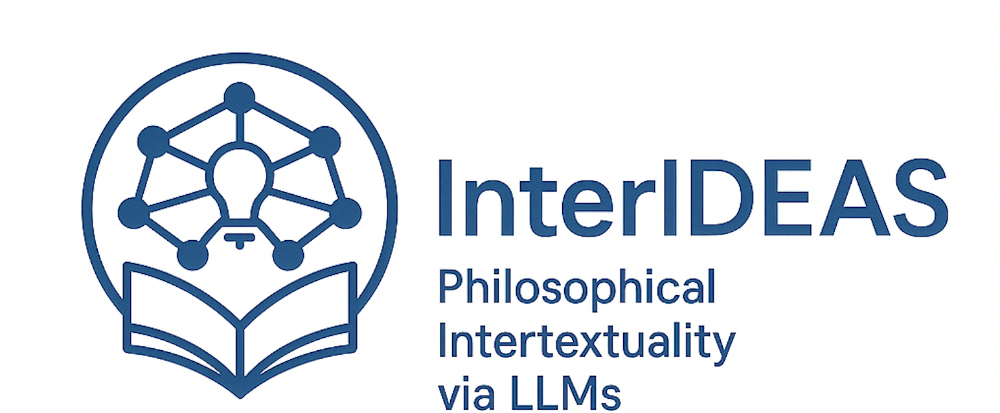
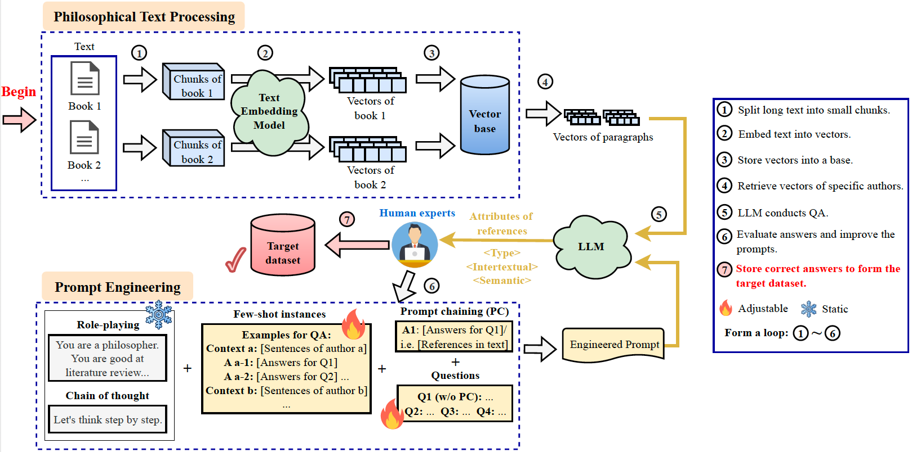

# 📚 InterIDEAS: A Philosophical Intertextuality via LLMs        📚 📚 📚 

## 🔍 Project Overview

The formation and circulation of ideas in philosophy significantly impact both pedagogical and scholarly practice. However, traditional analytical methods are often constrained by the **subjectivity and cognitive limitations** of human researchers.

**InterIDEAS** addresses this challenge by introducing a pioneering LLM based study that is the **first to combine Large Language Models (LLMs) with human expertise** in philosophy.

## 📘 Highlights

- **Scale**: Over **45,000 pages** of philosophical text.
- **Scope**: Encompasses key works from **1750 to 1950**, across all major schools of thought.
- **Authors**: Covers contributions from over **3,150 philosophers**.
- **Augmentation**: Enhanced with **intertextual theory** from literary studies and **bibliometric techniques** to contextualise philosophical references.
- **Annotation**: Enriched with **intertextual function**, **content type**, and **sentiment** labels for each bibliographic reference.

## 🎯 Purpose and Contributions

InterIDEAS supports **quantitative and qualitative mining** of philosophical knowledge and aims to reveal the **social, historical, intellectual, and interpersonal** relationships embedded in philosophical texts.

Key contributions include:
- A **novel LLM+expert annotation workflow** for large-scale text analysis.
- Theoretical integration of **literary intertextuality** and **bibliometrics**.
- A **benchmark resource** for studying **intertextual patterns**, **sentiment**, and **conceptual engagement** in philosophical writing.

## 🔬 Evaluation

We validated the utility of InterIDEAS through two experiments:
- **User Experiment**: Demonstrates effectiveness for both practical and conceptual inquiry.
- **Fine-Tuning Experiment**: Shows improvement in downstream model performance when trained on philosophically rich, intertextually annotated data.

These results highlight a **mutual benefit**:
- LLMs enhance the **study of philosophy** through scalable, accurate analysis.
- Philosophy improves **LLM understanding** by introducing **domain complexity, nuance, and abstraction**.

## 🤝 Interdisciplinary Outlook

InterIDEAS paves the way for **cross-disciplinary innovation** by demonstrating how humanistic and computational approaches can **co-evolve**.

We envision applications in:
- **Digital humanities**
- **Interpretable AI**
- **Cross-domain generalisation**
- **Curriculum design for philosophy education**
## Data Collection
The figure below shows the workflow of our data collection approach.




# 📚 Philosophical Bibliography Dataset

This dataset is a structured compilation of bibliographic entries related to **philosophy books**, enriched with metadata designed to support analysis of intertextual references in philosophical texts.

## 📖 Dataset Overview

Each entry in the dataset corresponds to a reference in a philosophy book and includes the following annotated fields:

### 1. **Book Title**
- For analytical clarity, we use the **author's name** as a stand-in for the book title.
- When an author has multiple books, we append integers (`1`, `2`, `3`, ..., `n`) to distinguish them.
- A complete **mapping of actual book titles to author names** is available in the **supplementary materials** of the accompanying paper.

### 2. **Reference Name**
- The specific source being cited or discussed in the text.

### 3. **Content Type**
Each reference is classified into one of three content types:
- **Nominal**: Mentions of specific names or titles.
- **Verbal**: Direct quotations from other texts.
- **Thematic**: Loose references or brief summaries indicating unspecified external ideas.

### 4. **Intertextual Function**
Describes the role the reference plays within the citing text. This includes:
- `ND`: Name-dropping (mention without elaboration)
- `CEx`: Contextual Explanation (descriptive background)
- `CEn`: Critical Engagement (analytical or evaluative discussion)
- `CAoE`: Conceptual Application or Expansion (building upon or adapting ideas)

This categorisation highlights the **depth and nature of engagement** with cited works.

### 5. **Sentiment**
Captures the author's **attitude toward the reference**, classified as:
- `Negative`
- `Neutral`
- `Positive`

This helps infer **rhetorical stance and interpretive framing**.

Each reference in the dataset has a **one-to-one correspondence** with its:
- Content Type
- Intertextual Function
- Sentiment label

## ✅ Quality Evaluation

To assess the accuracy of automated annotation using LLMs (e.g., ChatGPT), we performed a random sample evaluation:

| Metric                                  | Accuracy   |
|----------------------------------------|------------|
| Reference Detection                    | **98.11%** |
| Reference Content Extraction           | **93.00%** |
| Intertextual Function Classification   | **75.70%** |
| Sentiment Analysis                     | **86.40%** |

## 🗂 Supplementary Materials

- Book Title ↔ Author Name Mapping (CSV/JSON)
- Sample Annotation Sheet
- Evaluation Protocol

## 📌 Notes

- This dataset supports downstream tasks such as **intertextuality detection**, **sentiment-aware citation analysis**, and **LLM benchmarking** in abstract domains like philosophy.
- It can also be extended to related disciplines, such as **history**, **ethics**, or **law**.

# 🔧 Fine-Tune with Our Data (Experiment)

This repository contains the implementation of an NLP model using **PyTorch**, **Hugging Face Transformers**, **Datasets**, and **Accelerate** libraries. The goal is to demonstrate the effective application of **sequence classification** and **language modeling** techniques using cutting-edge transformer models and modern optimization tools.

## ⚙️ Installation

Before running the scripts, make sure you have Python installed. Then install the required packages via pip:

```bash
pip install torch datasets transformers accelerate peft
```

## 🧪 Interactive Tutorial

For a hands-on, interactive approach, use the provided Jupyter Notebook:

📘 `implementation_notebook.ipynb` guides you through:
- Data loading and preprocessing
- Model configuration and training
- Evaluation and analysis

To launch the notebook:

```bash
jupyter notebook Fine-tuning/TC-fine-tuning.ipynb
```
# License
All the data we currently open to public are originating from Project Gutenberg https://gutenberg.org/about/. Project Gutenberg eBooks may be freely used in the United States because most are not protected by U.S. copyright law. They may not be free of copyright in other countries. Readers outside of the United States must check the copyright terms of their countries before accessing, downloading or redistributing eBooks. We also have a number of copyrighted titles, for which the copyright holder has given permission for unlimited non-commercial worldwide use. For Project Gutenberg, no permission is needed for non-commercial use. So, for example, you can freely redistribute any eBook, anywhere, any time, with or without the Project Gutenberg trademark included. The ``Small Print'' has more details. Note that if you are not in the US, you must confirm yourself whether an item is free to redistribute where you are.

The copyright status of philosophy books can vary significantly depending on several factors, such as the date of the author's death and the specific laws of the country in which the book was published. Here are some general guidelines: In most countries, works enter the public domain 70 years after the death of the author. If the author of a philosophy book died more than 70 years ago, it is likely that their works are now in the public domain. Besides, some philosophy books, especially classic texts, may be in the public domain, but newer editions (which might include modern commentary, translations, or annotations) can still be protected by copyright.
Copyright laws can vary from one country to another. For example, some countries have extensions for certain types of works or authors.

For the remaining unpublished data, we are actively working on verifying the copyright status and obtaining the necessary permissions. We will continue to update our dataset as soon as we confirm the copyright status of each book and secure the appropriate permissions.

Dataset is licensed under CC BY 4.0

# Contact Us
If you have any questions regarding the dataset or publication, please creat an issue in this git repository.
